# UniCFDG

## What is it?

This is a runtime for executing a [Context Free Design Grammar](https://github.com/MtnViewJohn/context-free/wiki/About) and generating images using Unity as a runtime.

Those images can be saved on disk and have the grammar encoded using Steganography. This was done during Unity Hackweek 2020.

Here is the [hackweek video](https://youtu.be/2GQa1o2xF9s) I produced.

## What are CFDG?

CFDG are a way to express how to buyild an image through a series of rules that would draw a from a set of 3 primities (square, circle, triangle). As an example a the following grammar:

```
startshape START
background { b -1 }

rule START {
   SPIRAL{}
   SPIRAL { r 120 }
   SPIRAL { r 240 }
}

rule SPIRAL {
   F_SQUARES { }
   F_TRIANGLES { x 0.5 y 0.5 r 45 }
   SPIRAL { y 1 r 35 s 0.97 }
}

rule F_SQUARES {
  SQUARE {  hue 220 sat 0.9 b 0.33  }
   SQUARE { s 0.9  sat 0.75 b 1 }
   F_SQUARES { s 0.7 r 15 hue 55}
}

rule F_TRIANGLES {
  TRIANGLE { s 1.9 0.4 sat 0.7 b 1 }
  F_TRIANGLES { s 0.8 r 5 hue 25}
}
```

Would yield the following image :

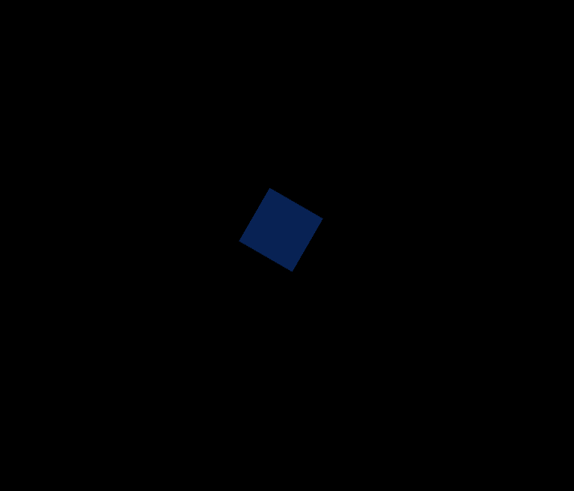

A CFDG can be deterministic i.e it will always generate the same image, or you can have "randomness" by adding probability to a rule to generate something different each time.

## How to use?

1) Load of the 2 demo scenes:
    - `Assets/Scenes/CfdgMeshRenderer.unity`
    - `Assets/Scenes/CfdgPrefabRenderer.unity`
2) Go into **Play Mode**
3) Select the CfdgPlayer object in the scene
4) Tweaks the various parameters.

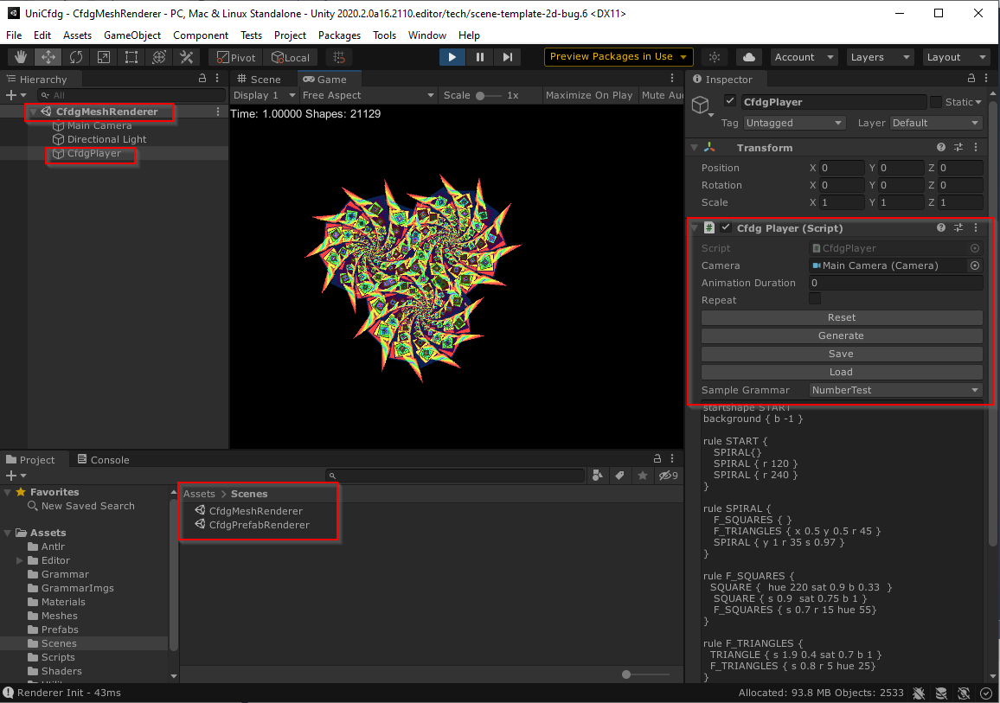

## Technical overview of the implementation

Here are a few notes detailing the code use in the project.

### CFDG Compiler

[CfgCompiler.cs](Assets/Scripts/CfgCompiler.cs) : this is the compiler that will parse a CFDG grammar and output a `Grammar` (see [CfdgEvaluator.cs](Assets/Scripts/CfdgEvaluator.cs)). I use [Antlr](https://www.antlr.org/) in order to generate a Parser Visitor (see [CfdgVisitor.cs](Assets/Scripts/CfdgVisitor.cs)).

The subset of CFDG I support is specified in the grammar file : [Grammar/Cfdg.g4](Assets/Grammar/Cfdg.g4). An Antlr grammar specification is itself a [EBNF](https://tomassetti.me/ebnf/):

```
contextfree : statements EOF ;

statements : statements statement | ;

statement : startshape | background | design_rule ;

startshape : STARTSHAPE NAME ;

background : BACKGROUND '{' color_adjustments '}' ;

design_rule
    : RULE NAME '{' replacements '}'
    | RULE NAME num '{' replacements '}'
    ;
    
replacements : replacement_loop* ;

replacement_loop 
    : replacement 
    | NUMBER '*' modification replacement
    | NUMBER '*' modification '{' replacements '}'
    ;

replacement : NAME modification ;

...
```

Before using Antlr to generate the parser I tested the Evaluator using a hand generated Grammar (See [SampleGrammars.cs](Assets/Scripts/SampleGrammars.cs)). A generated Grammar would look like this:

```CSharp
public static Grammar SimpleSquare()
{
    var grammar = new Grammar();
    grammar.name = "SimpleSquare";
    grammar.backgroundColor = new HsvColor() { h = 20, s = 0.7f, v = 0.9f };

    {
        var initRule = new Rule();
        initRule.name = "init";

        var s1 = new Replacement();
        s1.id = "square";
        s1.color = new HsvColor() { h = 100, s = 0.5f, v = 0.5f };

        var s2 = new Replacement();
        s2.id = "square";
        s2.color = new HsvColor() { h = 200, s = 0.7f, v = 0.7f, a = 0.5f };
        s2.transform *= Matrix4x4.Scale(new Vector3(0.5f, 0.5f, 1));

        initRule.replacements = new[] { s1, s2 };

        grammar.startShape = "init";
        grammar.AddRule(initRule);
    }

    {
        var squareRule = new Rule();
        squareRule.name = "square";
        var s1 = new Replacement();
        s1.SetSquare();
        s1.transform = Matrix4x4.Rotate(Quaternion.Euler(new Vector3(0, 0, 45)));
        s1.color = new HsvColor() { h = 45 };
        squareRule.replacements = new[] { s1 };

        grammar.AddRule(squareRule);
    }

    return grammar;
}
```

### Evaluator

The [CfdgEvaluator.cs](Assets/Scripts/CfdgEvaluator.cs) file contains all the code necessary to evaluate a `Grammar` instance and generate the set of Shapes to draw. Each shape has its own transform and hsv color.

Currently the evaluator is blocking the main thread which means it can be long to evaluate some grammar (Dots would help here...). Also the Evaluator is implementing a culling algorithm to stop rule evaluation if the generated shape would be too small. 

### Cfdg Player

The Player is responsible to setup the `Evaluator` and allow a user to save/load a grammar. The Player also supports a very limited animation feature: it shows the order in which shapes would be drawn on screen. The Player itself doesn't render anything.

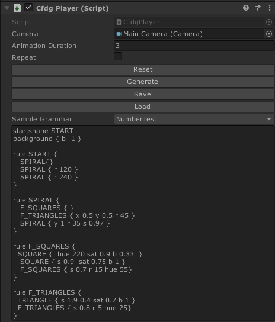

- **Animation duration**: time taken to draw all shapes in a Grammar.
- **Repeat**: Animation will loop infinitely.
- **Reset**: Redraw the grammar (using animation). This doesn't reevaluate the Grammar if random rules were used.
- **Generate**: Evaluate the Grammar. This can be long for some Grammar (~1second to ~7seconds).
- **Save**: save the current Game view as a png image with the grammar encoded using Steganography.
- **Load**: Load a png image and if a Grammar is encoded in it, it will load this grammar and evaluate it.
- **Sample grammar**: load a sample Grammar.

### Mesh Renderer

If you load the sample Scene `Assets/Scenes/CfdgMeshRenderer.unity` It uses a Mesh Renderer. Each set of primitives shapes is render using a single draw call. It uses `ComputeBuffer` to pass the various information (i.e shape transform and color) to the shader.

```CSharp
// This draws all shapes of a specific type in one draw call.
// argBuffers contains all the transform and color information of the shapes.
Graphics.DrawMeshInstancedIndirect(mesh, 0, material, bounds, argsBuffer);
```

It was my first experience with shader, compute buffer, custom material or anything remotely Graphic so most of the code was taken from various examples and is probably full of bugs because I played the Sorcerer Apprentice.

Two things of note:
- I chose not to create a single mesh because I wanted to animate the drawing of each shape. See the Prefab Renderer combine feature for information on combining all of the shape in a single big mesh.
- I assign a Z value to all shapes to place them on their own layer. A layer can only contain shapes of the same type.


The parameters of the renderer are attached to the CfdgPlayer object:
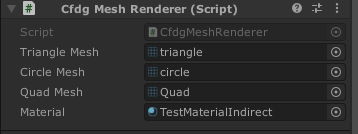
- I generated the primitive mesh as simple 2D shapes.
- You can assign any mesh here and they would be use to render the 3 primitives shapes.

### Prefab Renderer

Loading `Assets/Scenes/CfdgPrefabRenderer.unity` will use a different rendering scheme. Here the renderer will instantiate prefabs ins tead of rendering meshes directly.

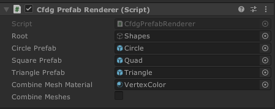

This means a Grammar might generate thousands of prefab instantiation! Performance is way worse than the MeshRenderer. In order to *animate* the drawing of the shapes I just enable/disable the various instanced shapes.

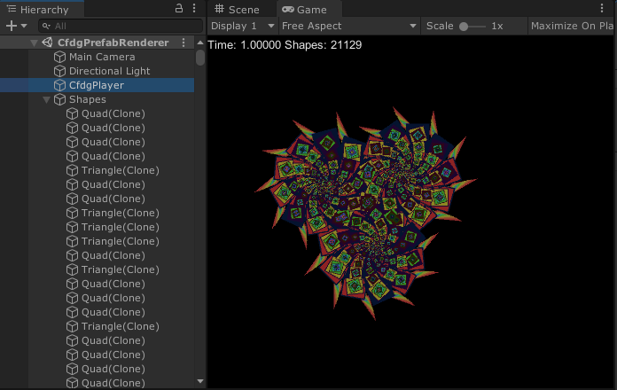

Note that you can assign any prefabs to the renderer. This means a CFDG could be use to generate a level procedurally.

If you check the **Combine Meshes** option it will generate a single mesh. But this mesh is not animated.

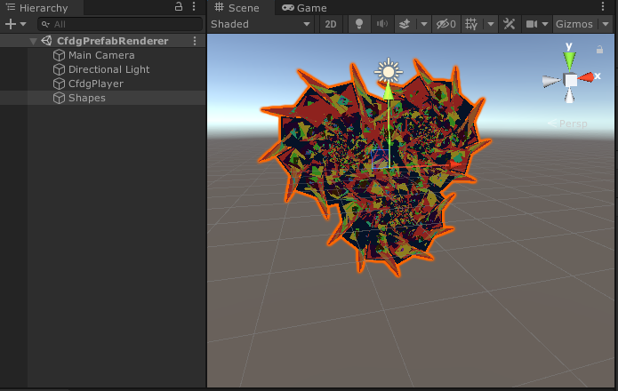

### Using Steganography

## Some pretty images

I didn't author any grammar myself. I taken all of them from the [Context free Art](https://www.contextfreeart.org/) website. This is a few of the images that are contained in the `Assets/GrammarImgs` folder and that are encoded with a grammar.

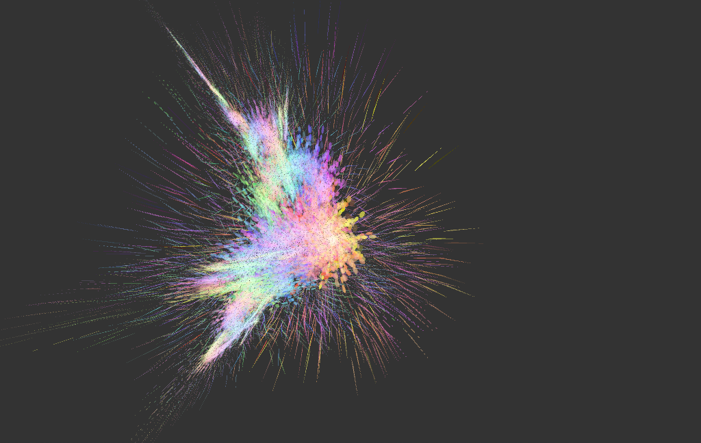
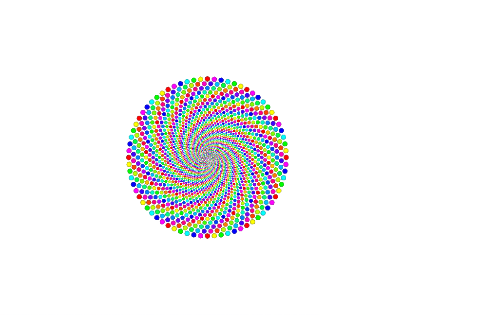
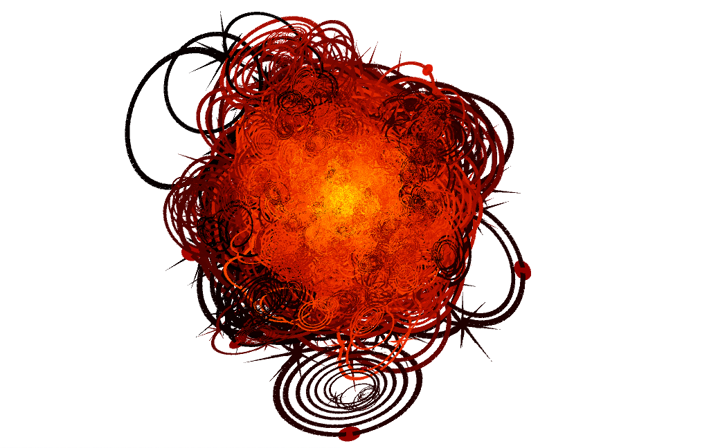
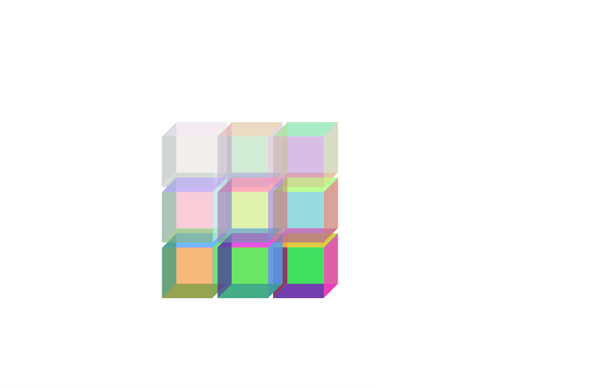
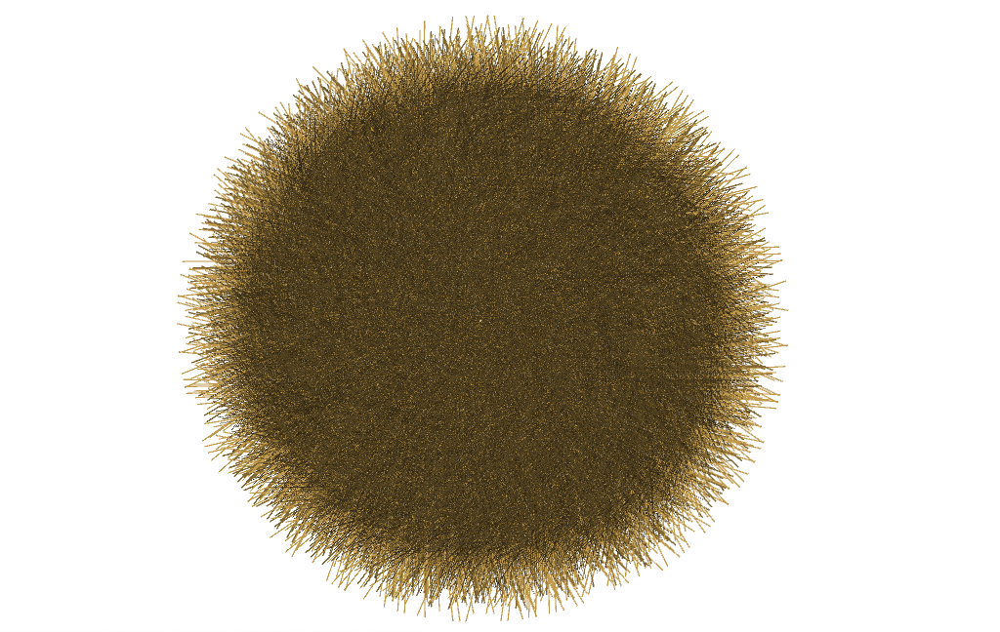

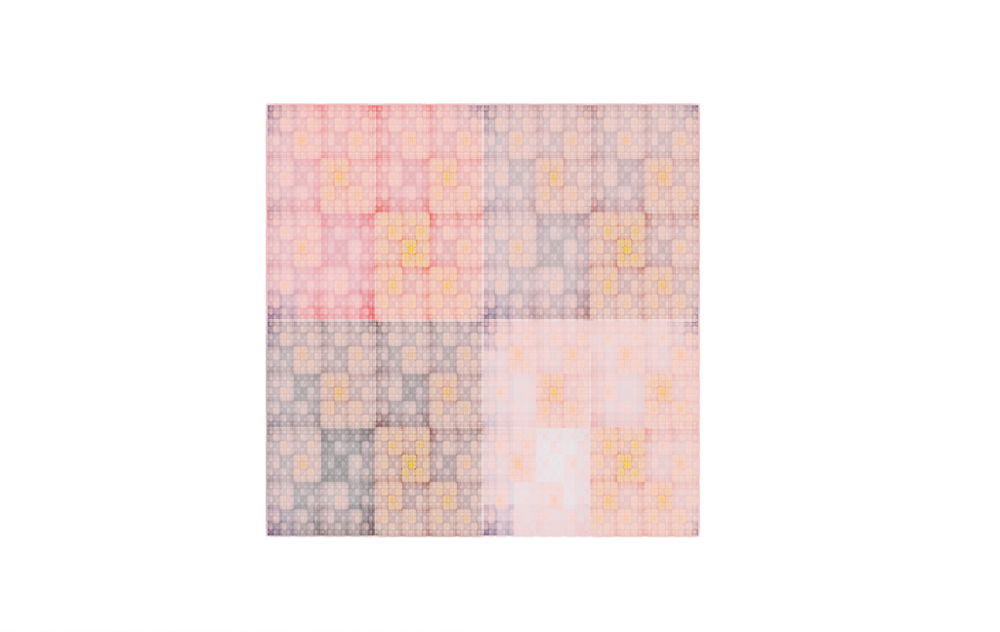
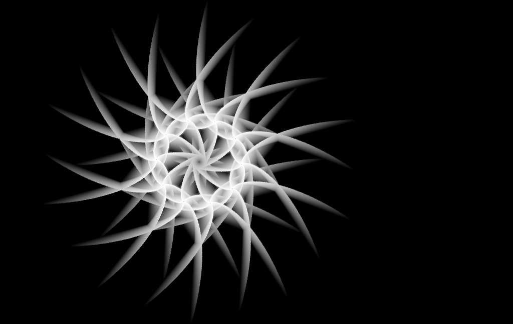
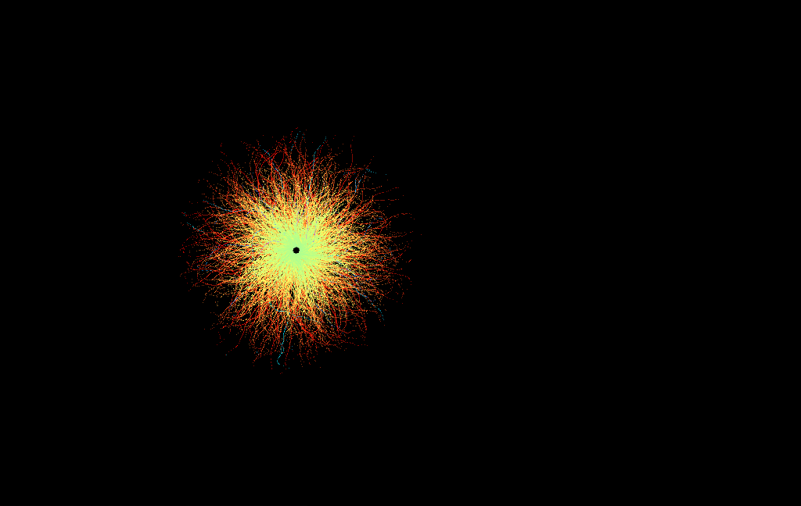
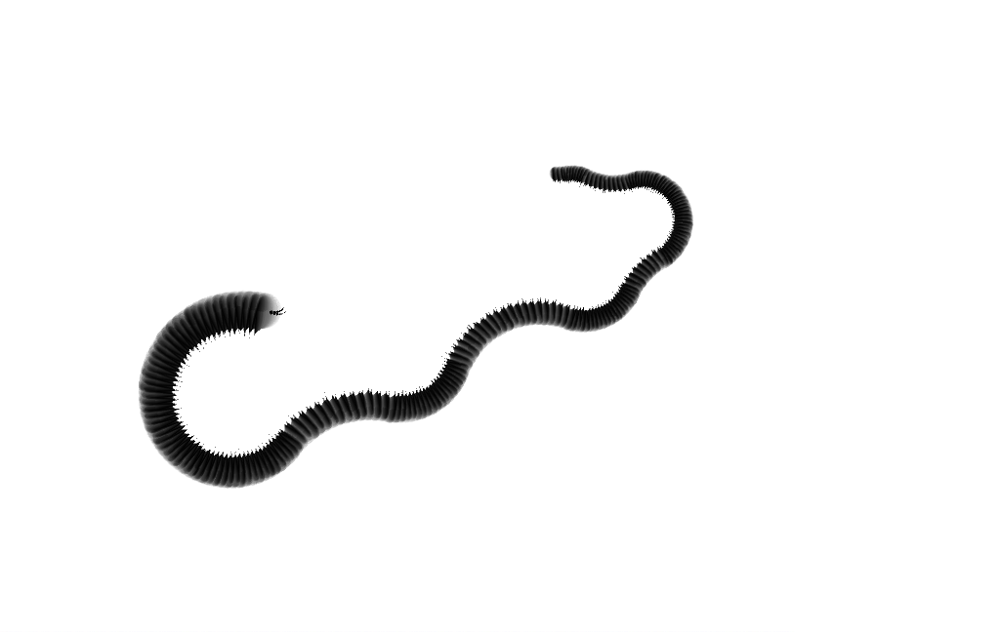
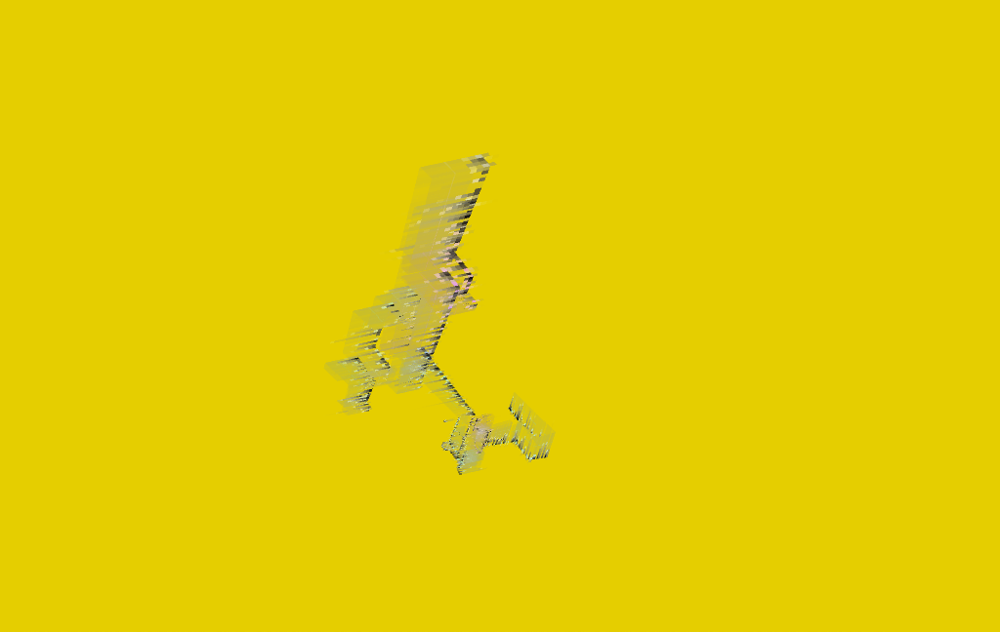


## TODO
- `Grammar` API is not easy to use if you would like to setup your grammar by hand instead of parsing a CFDG using the `Compiler`.
- Culling need to be improved to limit the amount of "too small" shapes.
- Grammar are generated with a max of 500K shapes (hardcoded limit). If culling was a bit better we would probably not need this limit.
- Auto camera placement is buggy.
- Loop (using `*` operator) is not implemented.
- For some grammar positioning of shapes can be off.
- Image generation is too slow and should be done over multiple frames.
- Steganography only works for RGBA textures.